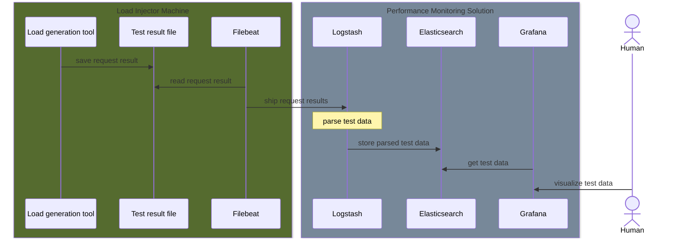

# Performance testing monitoring solution
## About

The solution is used to store and visualize performance test result.  
It is based on ELK-stack and Grafana:

*  [Filebeat](https://www.elastic.co/beats/filebeat) running on a load generator machine reads the result of each request and sends it to a Logstash
*  [Logstash](https://www.elastic.co/logstash) parses the result of each request and stores it in Elasticsearch
*  [Elasticsearch](https://www.elastic.co/elasticsearch/) is used to store the result of each request
*  [Grafana](https://grafana.com/) visualizes test results
*  [Kibana](https://www.elastic.co/kibana) is an additional tool used to visualize and view raw data stored in Elasticsearch
*  [haproxy](https://www.haproxy.org/) is used to unload HTTPS to Grafana and Kibana

## How to run

Set all required environment variables in `.\.env` file and execute `docker compose up -d`

### Environment variables

1. `ELK_VERSION`: version of ELK stack
1. `ES_HOST`: Elasticsearch instance hostname used in internal docker network
1. `ES_PORT`: Elasticsearch instance port  used in internal docker network
1. `LOGSTASH_PORT`: Logstash instance port  used in internal docker network
1. `KIBANA_PORT`: Kibana instance port  used in internal docker network
1. `EXTERNAL_IP`: IP of the server running the solution: Logstash, Elasticsearch, Grafana, Kibana
1. `EXTERNAL_HOST`: hostname of the server running the solution: Logstash, Elasticsearch, Grafana, Kibana
1. `USE_EXTERNAL_CERT`: if set to true Haproxy uses a certificate stored at `./secrets/external/external.pem`. If set to `false` and `./secrets/external/external.pem` doesn't exist, the setup step generates a self-signed certificate.
1. `ELASTIC_PASSWORD`: password for `elastic` Elasticsearch [built-in user](https://www.elastic.co/guide/en/elasticsearch/reference/current/built-in-users.html)
1. `KIBANA_PASSWORD`: password for `kibana_system` Elasticsearch [built-in user](https://www.elastic.co/guide/en/elasticsearch/reference/current/built-in-users.html)
1. `LOGSTASH_USER`: username for Elasticsearch user used by Logstash to push test data
1. `LOGSTASH_PASSWORD`: password for Elasticsearch user used by Logstash to push test data
1. `ELASTIC_GRAFANA_USER`: username for Elasticsearch user used by Grafana to read test data indices
1. `ELASTIC_GRAFANA_PASSWORD`: password for Elasticsearch user used by Grafana to read test data indices
1. `GRAFANA_USER`: username for a Grafana admin user
1. `GRAFANA_PASSWORD`: password for a Grafana admin user
1. `ES_HEAP`: Elasticsearch instance heap space size
1. `LOGSTASH_HEAP`: Logstash instance heap space size

## Loading sample test data set

By default, the solution doesn't contain any test data.  
To load the default sample test data set:

1. Excute `sudo chmod go-w filebeat/filebeat.yml` to ensure `filebeat\filebeat.yml` has write permission only for the owner
1. run `docker compose -f docker-compose.filebeat.yml up -d` command from project root folder. 
It starts the Filebeat container that pushes test data from `sample-data-set` folder to the solution.

## Grafana dashboards

